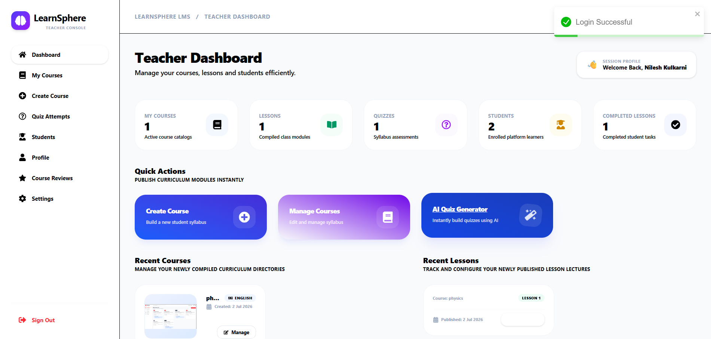

# 🎓 LearnSphere – AI-Powered Learning Management System

LearnSphere is a full-stack AI-powered Learning Management System (LMS) that enables educators to create and manage online courses while providing students with an engaging learning experience. The platform integrates **Google Gemini AI** to automate quiz generation, generate lesson summaries, and explain quiz answers, making learning more interactive and personalized.

---

## 🚀 Key Features

### 👨‍🏫 Teacher Portal

- Secure JWT Authentication
- Create, update, and manage courses
- Upload video lessons and learning materials
- Create and manage quizzes
- Generate AI-powered quizzes using Gemini AI
- View enrolled students and course reviews
- Dashboard with course analytics

### 👨‍🎓 Student Portal

- Register and login securely
- Browse and enroll in courses
- Watch lesson videos
- Generate AI-powered lesson summaries
- Attempt quizzes with instant feedback
- View quiz history and learning progress
- Submit course ratings and reviews

### 🤖 AI-Powered Features

- **AI Quiz Generator:** Automatically generates multiple-choice questions based on a given topic.
- **AI Lesson Summary:** Creates concise, exam-focused summaries from lesson content.
- **AI Answer Explanation:** Explains why an answer is correct or incorrect after quiz submission.

---

# 🛠 Tech Stack

| Category       | Technologies                                |
| -------------- | ------------------------------------------- |
| Frontend       | React.js, Tailwind CSS, React Router, Axios |
| Backend        | Node.js, Express.js                         |
| Database       | PostgreSQL                                  |
| Authentication | JWT, bcrypt.js                              |
| AI Integration | Google Gemini API                           |
| File Upload    | Multer                                      |

---

# 📂 Project Structure

```
LearnSphere
│
├── Backend
│   ├── config
│   ├── controllers
│   ├── middleware
│   ├── models
│   ├── routes
│   ├── services
│   ├── validators
│   └── uploads
│
├── frontend
│   ├── components
│   ├── context
│   ├── pages
│   ├── routes
│   ├── services
│   └── assets
│
└── README.md
```

---

# 🏗 System Modules

- Authentication & Authorization
- Course Management
- Lesson Management
- Enrollment System
- Quiz Management
- AI Services
- Progress Tracking
- Review & Rating System
- Teacher Dashboard
- Student Dashboard

---

# 🗄 Database Design

The application uses **PostgreSQL** with the following core entities:

- Users
- Courses
- Lessons
- Enrollments
- Quizzes
- Questions
- Quiz Attempts
- Progress
- Reviews

---

# 🔒 Security Features

- JWT-based Authentication
- Password Hashing with bcrypt
- Role-Based Access Control (RBAC)
- Protected REST APIs
- Input Validation
- Secure File Upload Handling

---

# ⚙️ Installation

## Clone the Repository

```bash
git clone https://github.com/your-username/LearnSphere.git

cd LearnSphere
```

---

## Backend Setup

```bash
cd Backend

npm install

npm run dev
```

---

## Frontend Setup

```bash
cd Frontend

npm install

npm run dev
```

---

# 🔑 Environment Variables

Create a `.env` file inside the **Backend** directory.

```env
PORT=5000

DATABASE_URL=your_postgresql_database_url

JWT_SECRET=your_jwt_secret

GEMINI_API_KEY=your_gemini_api_key
```

---

# 📸 Screenshots

## 🏠 Home Page


---

## 🔐 Login Page


---

## 👨‍🎓 Student Dashboard


---

## 👨‍🏫 Teacher Dashboard



---

## 📚 Course Details


---

## 🎥 Lesson Player


---

## 🤖 AI Quiz Generator


---

## 📖 AI Lesson Summary


---

## 📈 Student Progress Tracker


# 🚀 Future Enhancements

- Google OAuth Authentication
- Forgot Password via Email
- AI-Based Course Recommendations
- Personalized Learning Paths
- Assignment Submission
- Certificate Generation
- Discussion Forum
- Live Classes
- Email Notifications

---

# 💡 Key Highlights

- Full-stack LMS built using the PERN stack.
- AI-powered learning assistance with Google Gemini.
- Role-based authentication for Teachers and Students.
- Secure RESTful API architecture.
- Responsive UI built with React and Tailwind CSS.
- PostgreSQL relational database with normalized schema.

---

# 👨‍💻 Author

**Aradhya Kulkarni**

B.Tech Information Technology Student

- Full Stack Developer
- Passionate about Web Development, AI, and Scalable Applications

---

## ⭐ Support

If you found this project useful, consider giving it a **⭐ Star** on GitHub. It helps others discover the project and motivates future improvements.
